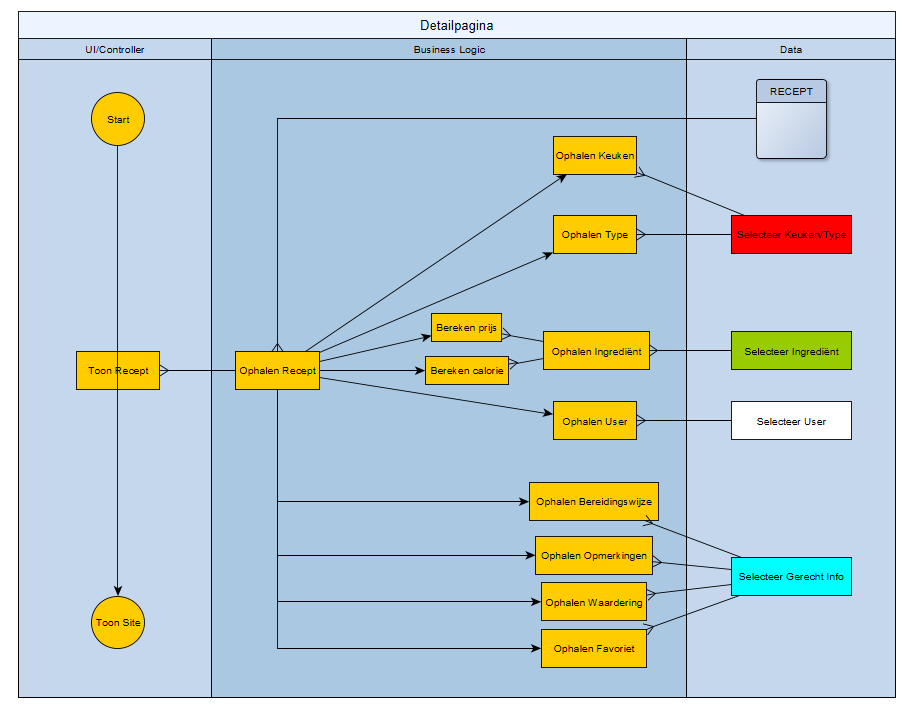
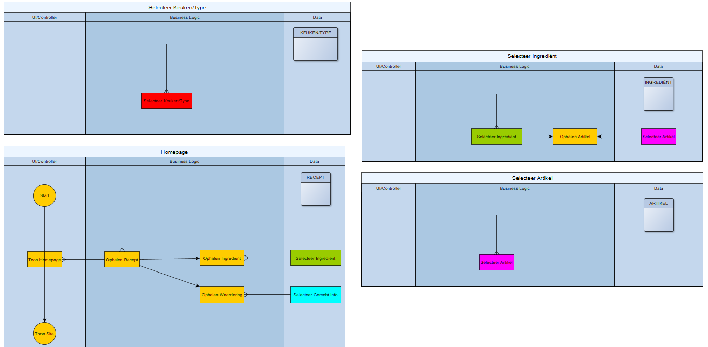

<h1>Verrukkulluk</h1>
De website Verrukkulluk is door mijn ontwikkeld voor een project van Educom. Op deze receptenpagina wordt aan de hand van verschillende functies en technieken een samenhangend concept geëtaleerd waar front-end en back-end methodes samen tot een geheel product komen.
  
Het project is van te voren uitgewerkt met een ASD en ERD, aan de hand van deze is zorgvuldig een database opgebouwd waar aan de hand van verschillende functies in PHP recepten, boodschappen en andere gegevens kunnen toegevoegd of verwijderd. 
  

 
<h2>Technologieën </h2>
Voor het maken van deze applicatie/website is gebruik gemaakt van zowel back-end als front-end technologieën. De back-end is voornamelijk geschreven in PHP in combinatie met een SQL database, dat is bijgehouden met phpMyAdmin. De front-end is samengesteld met behulp van HTML en CSS binnen een template van Twig-Symfony.
 
Een volledige lijst van gebruikte technologieën:
 
<ul>
    <li>SQL/phpMyAdmin</li>
    <li>Twig-Symfony</li>
    <li>HTML/CSS</li>
    <li>PHP</li>
    <li>Bootstrap</li>
    <li>Javascript</li>
    <li>JQuery</li>
    <li>FontAwesome</li>
</ul>
 

<h2>Methoden & Technieken</h2>
<h3>Entity Relationship Diagram</h3>
Dit diagram laat zien hoe de verschillende primary keys in relatie staan met elkaar. De modellering hier van helpt bij het maken van een samenhangende database en met het koppelen van de losse facetten.
 

 

<h3>Application Structure Diagram</h3>
De ASD wordt gebruikt om te kijken welke functies in relatie staan met elkaar, en op wat voor manier deze gebruikt kunnen worden om niet in herhaling te treden. Dit is voornamelijk handig omdat je niet veel in herhaling zult treden en een overzichtelijk beeld krijgt hoe dit het beste aangepakt kan worden.
 

 

<h6>*Zie de map 'Modellering' voor de volledige diagrammen.</h6>

